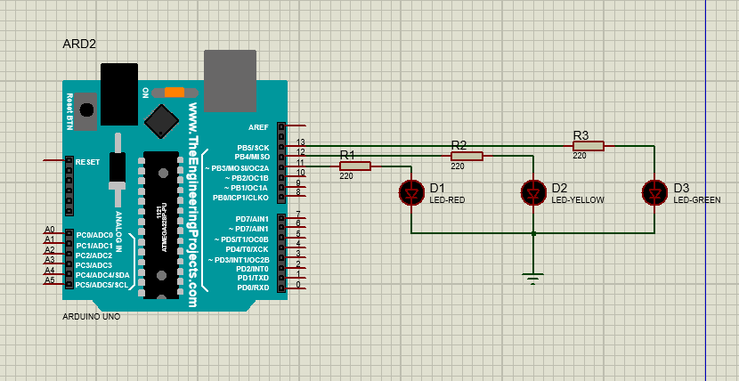

# Traffic Light Control System

## Overview
Arduino-based traffic light simulator with timed sequence control.

## Components Used
- Arduino Uno
- LEDs (red, yellow, green)
- Resistors (220Ω)
- Breadboard
- Jumper wires

## Circuit Diagram

## Project Media
[Video of Working Project](https://drive.google.com/file/d/1JWm2L4IJGw7lL7AngL84dj5aizoNo5hC/view?usp=sharing)

## Code Explanation
This project implements a state machine to control traffic light sequences with configurable timing.

## What I Learned
- Arduino programming fundamentals
- State management in embedded systems
- LED control circuits
